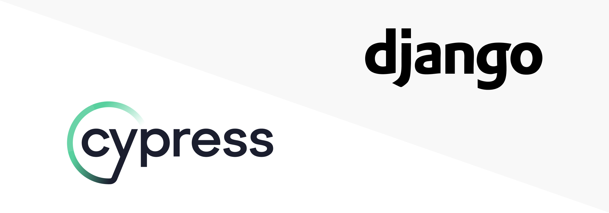

# django-cypress



*Out-of-the-box end-to-end testing for Django*

This package provides the necessary boilerplate to quickly begin
testing your Django applications using Cypress.

## Table of contents
- [Installation](#installation)
- [Example project](#example-project)
- [License](#license)

## Installation

The first step is to install [Cypress](https://www.cypress.io/) as a development dependency.
```
npm install cypress --save-dev
```

Install the `django_cypress` package.
```
pip install django_cypress
```

Add the `django_cypress` app to the `INSTALLED_APPS` to the `settings.py` file:
```python
INSTALLED_APPS = [
    ...
    'django_cypress'
    ...
]
```

Include the URLs of the `django_cypress` app to the `urls.py` file.
```python
urlpatterns = [
    path("", include("django_cypress.urls")),
]
```

Generate the Cypress boilerplate to copy over the initial boilerplate files for your Cypress tests.
```
python manage.py cypress_boilerplate
```

We have provided a `e2e/example.cy.js` spec for you as an example. Open Cypress.
```
npx cypress open
```
In the Cypress window that appears, select "E2E Testing," followed by
"Start E2E Testing in Chrome." This action will display a list of all 
the specs in your application. Click on `example.cy.js` to execute it.

## Example Project

If you're having difficulties setting up a project using `django_cypress`,
there is an example project that you can refer to [here](https://github.com/HelloWorld-PC/django-cypress/tree/main/example).
Instructions on running this example project are available in
this [README.md](https://github.com/HelloWorld-PC/django-cypress/blob/main/example/README.md) file.

## License
The MIT License (MIT). Please see [License File](https://github.com/HelloWorld-PC/django-cypress/blob/main/LICENSE) for more information.